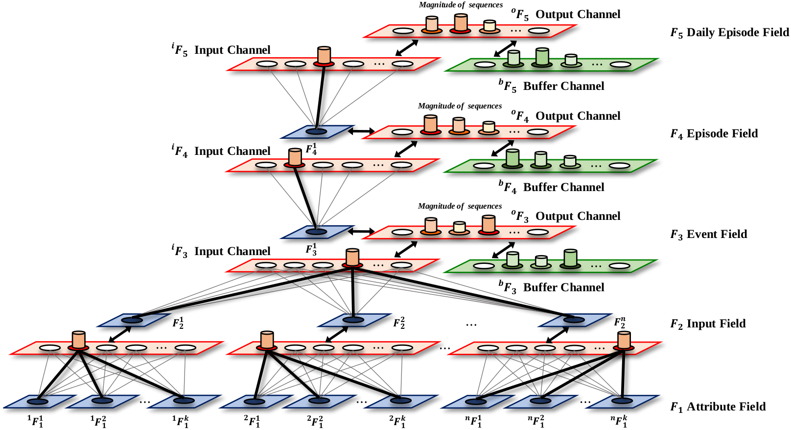

# DeepART
C++ Code for Deep ART Neural Model (tested on Ubuntu 16.04)




## Related Publication
* Gyeong-Moon Park, Yong-Ho Yoo, Deok-Hwa Kim, and Jong-Hwan Kim, "Deep ART Neural Model for Biologically Inspired Episodic Memory and Its Application to Task Performance of Robots", *IEEE Transactions on Cybernetics*, vol. 48, no. 6, pp. 1786-1799, Jun. 2018.

## Dataset
* Change the xml file "*dataset.xml*" to train and test the Deep ART model. In this file, you can modify the attributes and episode lists for episode training, and the cue lists for episode retrieval.

## Usage
1. cd (DeepART folder)
2. mkdir build
3. cd ./build
4. cmake ..
5. make
6. ./deep_art

## License
[MIT](https://github.com/angular/angular.js/blob/master/LICENSE)

## Contact
gmpark@rit.kaist.ac.kr

<!---```python
def test()
    pass
```
